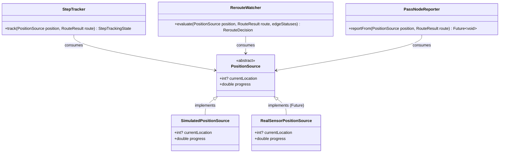

# Map Module

The **Map Module** (`lib/features/map`) is the most technologically complex component of the application. It handles custom 2D grid rendering, graph-based pathfinding, and turn-by-turn simulated navigation within the hospital.

:::warning[Performance Considerations]
To ensure 60fps rendering even on lower-end devices, the map bypasses traditional Flutter Widget trees for its core view. Instead, it utilizes a custom `CustomPainter` (`MapGridPainter`) to paint directly to the canvas.
:::

## State Management

The module relies heavily on `map_provider.dart` to maintain granular state, separating view coordinates from active routing logic.

| Provider | Type | Description |
| :--- | :--- | :--- |
| `userPositionProvider` | `StateProvider<int?>` | Tracks the "You are here" grid cell. Updatable via QR scan or long-press. |
| `routeDestProvider` | `StateProvider<MapPoi?>` | Tracks the currently selected Point of Interest (POI). |
| `routeModeProvider` | `StateProvider` | Maintains the selected transportation mode (Walking, Wheelchair, Stretcher). |
| `navPhaseProvider` | `StateProvider<NavPhase>` | Drives the navigation lifecycle (`idle`, `navigating`, `paused`, `arrived`) and freezes the active route mid-trip. |
| `routeResultProvider` | `FutureProvider` | Assembles routing inputs and resolves the crowd-aware `RouteResult`. |

## Widget Types & Patterns

The Map module heavily relies on custom canvas painting over standard widget trees for optimal 60fps performance.

```text
📦 MapPage
├── 🏗️ Stack
│   ├── 🖌️ CustomPaint (MapGridPainter)
│   │   └── 🗺️ Renders Nodes, Edges, Route Path
│   ├── 🔍 SearchPanel (Floating Top)
│   ├── 🔘 FloatingActionButton (Recenter)
│   └── 🗂️ SlidingUpPanel (Route Details Sheet)
│       └── 🏗️ Column
│           ├── ⏱️ ETA Display
│           └── ⏯️ Playback Controls (Play/Pause)
└── 📷 Scanner Overlay (mobile_scanner)
```

## State Taxonomy

Due to the real-time requirements of navigation, state is highly granular:
- **Local UI State**: Minor animation tickers or sheet expansion statuses.
- **Provider State**: `userPositionProvider` (User location), `routeDestProvider` (Target POI), and `routeModeProvider` (Walking/Wheelchair).
- **Transient State**: `navPhaseProvider` drives the live navigation lifecycle, and the `NavigationController` holds the high-frequency metrics (ETA, remaining distance) updated during simulation.

## The Execution Lifecycle (Route Preview)

import MapFlowDiagram from '@site/static/img/diagrams/map-flow.svg';

<div style={{ textAlign: 'center', margin: '2rem 0' }}>
  <MapFlowDiagram width="100%" style={{ borderRadius: '16px', boxShadow: '0 4px 20px rgba(0,0,0,0.15)' }} />
</div>

:::info[Client is the routing authority]
The **client `RoutingEngine` computes routes** — online and offline. The
backend `route/preview` endpoint is a *crowd-blind* fallback used only when the
device has no local graph. See [Crowd-Aware Routing](#crowd-aware-routing) for
why.
:::

### 1. 💻 Trigger (UI Layer)
The user selects a destination POI from the search sheet. The UI updates the
target provider, which the route provider reactively watches.
```dart
ref.read(routeDestProvider.notifier).state = selectedPoi;
```

### 2. ⚙️ Orchestration (Provider Layer)
`routeResultProvider` assembles the live inputs — adjacency graph, congestion
edge statuses, blocking POI cells, and normalized **bottleneck weights** — and
hands them to `RoutingService`.
```dart
return service.route(
  mapId: mapId,
  startLocation: start,
  destLocation: dest.gridLocation,
  modeId: mode,
  adjacency: adjacency,
  cols: meta.cols,
  edgeStatuses: edgeStatuses,
  poiCells: poiCells,
  bottleneckWeights: bottleneckWeights,
);
```

### 3. 🧭 Execution (Client Engine — Authority)
`RoutingEngine` runs Dijkstra (4-neighbor) over the cached grid graph, applying
the crowd-aware soft cost so the returned path bends away from congested and
bottlenecked cells. Backend `route/preview` is only consulted if the engine has
no local graph (see [the cache flow](#2-route-cache--offline-replay-flow)).
```dart
final result = _engine.route(
  startLocation: startLocation,
  destLocation: destLocation,
  modeId: modeId,
  adjacency: adjacency,
  cols: cols,
  edgeStatuses: edgeStatuses,
  poiCells: poiCells,
  bottleneckWeights: bottleneckWeights,
);
```

### 4. 🔄 Canvas Reactivity (Rendering Layer)
The Riverpod state is mutated with the new node array. The custom canvas, which actively watches the routing state, immediately triggers a high-performance repaint, drawing the highlighted path.
```dart
// Inside MapGridPainter
if (routeNodes != null) {
  _drawHighlightedPath(canvas, routeNodes);
}
```

## Crowd-Aware Routing

Navigation must steer users **around crowded areas**. The backend router is
permanently crowd-blind (fixed-cost Dijkstra, no flow input, no `avoid_cells`
parameter) and cannot be changed, so crowd avoidance lives entirely on the
client. The client `RoutingEngine` is algorithmically identical to the backend
graph search but adds a **soft congestion + bottleneck penalty** to each edge.

### Soft Cost Model

The engine never hard-blocks a cell — it makes crowded cells *expensive*, so a
path is always returned even when the only way through is congested:

```dart
cost = cellDistance(from, to)
     * modeCostMultiplier(modeId)
     * (1 + congestion + kBottleneckPenalty * bottleneck);
```

| Term | Range | Source |
| :--- | :--- | :--- |
| `congestion` | `0..1` | Edge status from the live flow snapshot (clamped). |
| `bottleneck` | `0..1` | Normalized weight for the *entered* cell. |
| `kBottleneckPenalty` | `3.0` | Tunable constant — how hard to avoid bottlenecks. |

### Bottleneck Weights

`bottleneckWeightsProvider` turns the backend `flow/get_bottlenecks` list
(`{grid_location, count}`) into normalized weights:

* `weight = count / maxCount` across the batch (so the busiest cell is `1.0`).
* The backend list is **hospital-global with no floor scope**, so any cell whose
  index falls outside the current floor grid (`location >= rows * cols`) is
  dropped to avoid mis-mapping an off-floor cell onto this floor.

### Flow Freshness

Crowd avoidance is only as good as the flow snapshot it reads. Flow + bottleneck
data is **refreshed once, imperatively, when the user picks a destination**
(`_setRouteDestination` in `map_page.dart` invalidates `flowSnapshotProvider` and
`bottlenecksProvider`). During active navigation the route is frozen, so no
mid-trip refresh swaps the drawn path.

:::danger[Never freshen inside `routeResultProvider.build`]
Calling `ref.invalidate(flowSnapshotProvider / bottlenecksProvider)` *inside*
`routeResultProvider` — a provider that then `watch`es them in the same build —
creates an infinite rebuild loop: `invalidate → re-emit → rebuild → invalidate`.
In practice this recomputes the route and re-fetches bottlenecks thousands of
times per second the moment a start and destination are both set (UI lag,
flickering bottleneck pins). Freshen at the **action** that starts a route, not
in the provider build. Locked down by `route_result_loop_test.dart`.
:::

## Caching Architecture

To support resilient offline navigation inside the hospital, the Map module
employs a localized Hive-based cache. All cached objects are managed by
`MapCacheService` (`lib/features/map/data/services/map_cache_service.dart`) under
the `map_sync_full_cache` box.

### 1. Cached Elements

| Data Element | Cache Key Pattern | Description |
| :--- | :--- | :--- |
| **Sync Full** | `map:<mapId>:sync_full` | Entire bulk-synced graph snapshot. |
| **Floors** | `map:floors` | List of all floor metadata and grid dimensions. |
| **Granular Nodes** | `map:<mapId>:nodes` | Point of interest grid locations (`MapPoi`). |
| **Granular Edges** | `map:<mapId>:edges` | Walkable grid path links (`MapEdge`). |
| **Granular Meta** | `map:<mapId>:meta` | Floor configurations and boundaries. |
| **Obstacles** | `map:<mapId>:obstacles` | Dynamic path blockages and reports. |
| **Flow Snapshot** | `map:<mapId>:flow_snapshot` | Crowd density, edge congestion, and active alerts. |
| **Route Results** | `route:<mapId>:<start>:<dest>:<mode>` | Serialized calculated route paths. |
| **Active Route** | `route:active` | In-progress active guidance route path. |

### 2. Route Cache & Offline Replay Flow

`RoutingService` resolves a route through a fixed priority chain. Because the
client engine is the crowd-aware authority, it runs **first** regardless of
connectivity:

1. **Engine (crowd-aware) — primary**:
   * Whenever a local graph exists (`adjacency` is non-empty), `RoutingEngine`
     computes the path using the [soft cost model](#soft-cost-model).
   * The result is cached under `route:<mapId>:<start>:<dest>:<mode>`.

2. **Cache**:
   * If the engine produced nothing, a previously cached `RouteResult` matching
     the precise `(mapId, start, dest, mode)` key is replayed verbatim.

3. **Preview fallback (online, crowd-blind)**:
   * Only reached when there is no local graph **and** the network is up. Calls
     backend `route/preview`, caches the result, and returns it.
   * This path ignores crowd data — it exists purely so a device that never
     synced a graph can still navigate.

4. **Failure**:
   * If none of the above yields a path, the request throws and the UI surfaces
     a "no route" state.

:::tip
The same chain backs `reroute()` during active navigation; the engine recomputes
a crowd-aware detour first, falling back to the cache, then to the backend
`route/recalculate` endpoint.
:::

## Flow Analytics Overlays

On top of the base grid, `MapGridPainter` renders live crowd-flow analytics,
each behind its own visibility toggle in the analytics panel. Every overlay is
**offline-first** — a failed fetch degrades to cached or empty data and never
throws into the widget tree.

| Overlay | Source | Rendering |
| :--- | :--- | :--- |
| **Density / Heatmap** | `flow/get_heatmap` → `FlowCell` | Green→red cell gradient. Density is normalized to `0..1` per batch so counts greater than 1 are not all clamped to max-red. |
| **Edge Status** | Flow snapshot `EdgeStatus` | Line between cell centers: solid red if `blocked`, otherwise orange lerped by `congestion`. |
| **Bottlenecks** | `flow/get_bottlenecks` | Numbered red pins at the busiest cells (discrete points, ranked by `count`). |
| **Alerts** | `flow/get_alerts` | Status chip; optionally highlights the referenced cell. |
| **Forecast** | `flow/get_forecast` | Time-offset slider; gracefully disabled while the endpoint is stubbed. |

:::note[Backend-stubbed layers]
`flow/get_alerts` and `flow/get_forecast` currently return placeholder payloads.
The client parses them defensively (empty list, no throw) and shows a "no data"
hint, so flipping the backend to real data requires no UI rework. Tracked in
`context/map_backend_blockers.md`.
:::

## Positioning Abstraction (`PositionSource`)

To facilitate seamless testing and future-proof the codebase for actual physical deployments, the Map module employs a polymorphic positioning abstraction. 

Because the hospital environment is an indoor space where GPS is unavailable, the current application version uses a **client-side simulation** to move the user along the active path. However, the navigation engine itself is completely decoupled from this simulation via the `PositionSource` abstraction.

### 1. Architectural Seam

By introducing a dedicated interface for positioning, the entire turn-by-turn guidance and dynamic rerouting logic consumes position updates uniformly, whether they originate from a simulated timer or future real-world hardware sensors.



### 2. Interface Definition

Defined in `lib/features/map/presentation/navigation/position_source.dart`:

```dart
abstract class PositionSource {
  /// The index of the current grid cell occupied by the user.
  /// Null if the user's position cannot be mapped to the grid.
  int? get currentLocation;

  /// Normalized value from 0.0 to 1.0 representing progress along the path.
  double get progress;
}
```

### 3. Implementations

* **`SimulatedPositionSource` (Current)**:
  Constructed by the navigation state notifier (Ticker-driven `NavigationController`). As the animation tick increases, it reports the interpolated cell index and fractional progress along the computed route.
  
* **`RealPositionSource` (Future Expansion)**:
  Will combine hardware inputs (e.g., Bluetooth Low Energy (BLE) beacon trilateration, Wi-Fi RTT, or UWB sensors) to determine the coordinates, run map-matching algorithms to snapping coordinates to the nearest valid walkable cell, and calculate progress relative to the active `RouteResult`.

### 4. Downstream Subsystems (Consumers)

The following components depend purely on the `PositionSource` contract, remaining agnostic to whether the user is physically walking or running a simulation:

| Subsystem | File Reference | Purpose |
| :--- | :--- | :--- |
| **Step Tracking** | [step_tracker.dart](file:///home/jerry/project/hospital-project/hospital-app/lib/features/map/presentation/navigation/step_tracker.dart) | Inspects the current path index to yield the current step, the next turn maneuver, and the distance remaining to the next instruction. |
| **Dynamic Rerouting** | [reroute_watcher.dart](file:///home/jerry/project/hospital-project/hospital-app/lib/features/map/presentation/navigation/reroute_watcher.dart) | Watches upcoming cells along the *remaining* path (starting from `PositionSource`'s current location). If any upcoming cell becomes congested or blocked, it triggers a recalculated detour. |
| **Telemetry Reporting** | [pass_node_reporter.dart](file:///home/jerry/project/hospital-project/hospital-app/lib/features/map/presentation/navigation/pass_node_reporter.dart) | Listens to the current position grid cell updates and pings the `route/pass_node` telemetry endpoint (queued locally when offline) to report travel milestones. |
